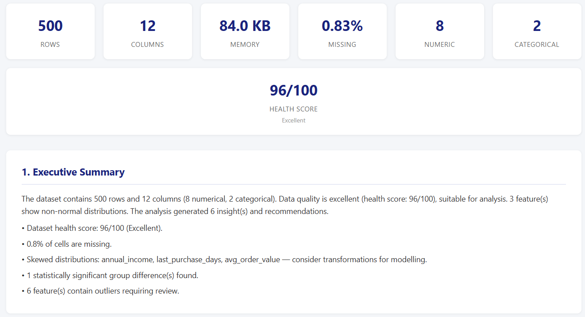
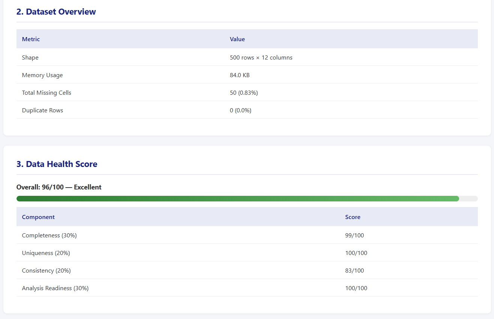
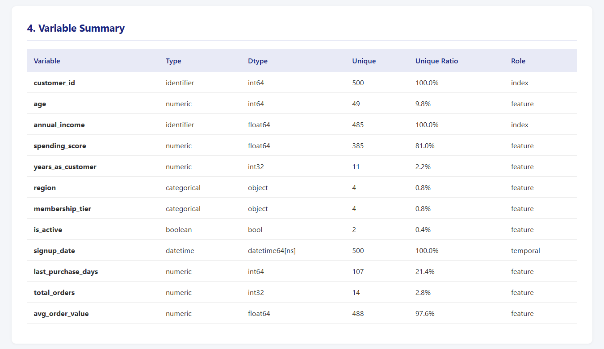
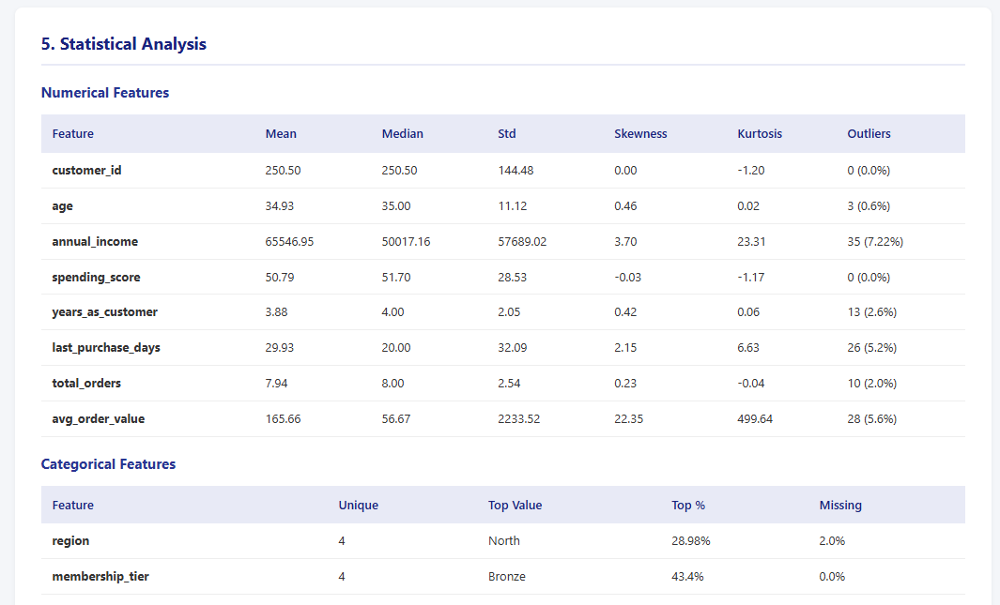
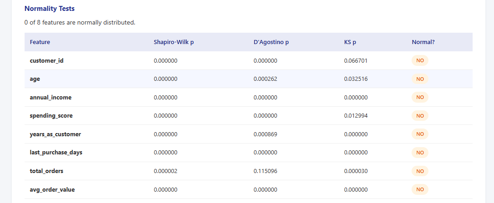
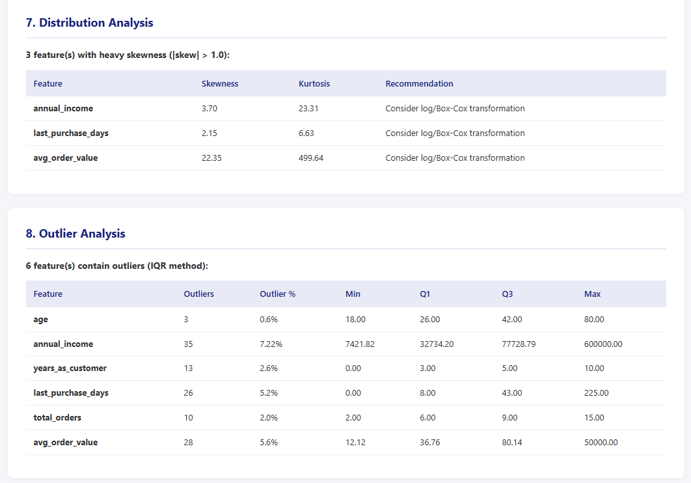
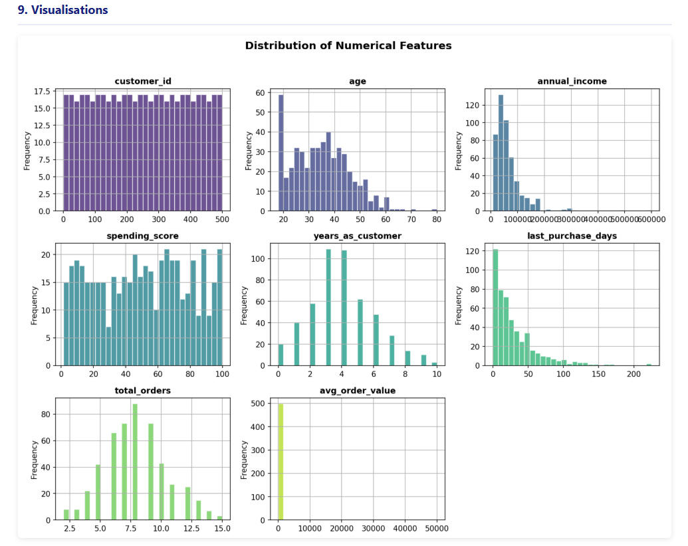
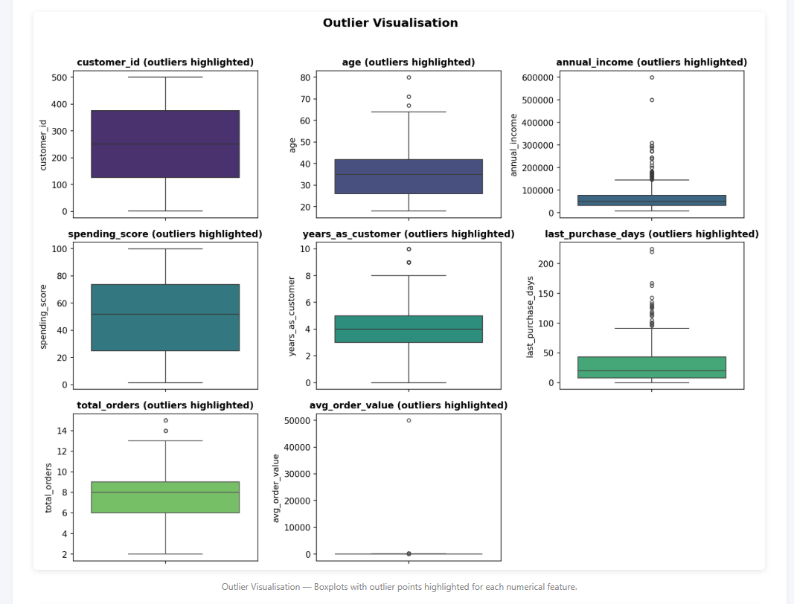
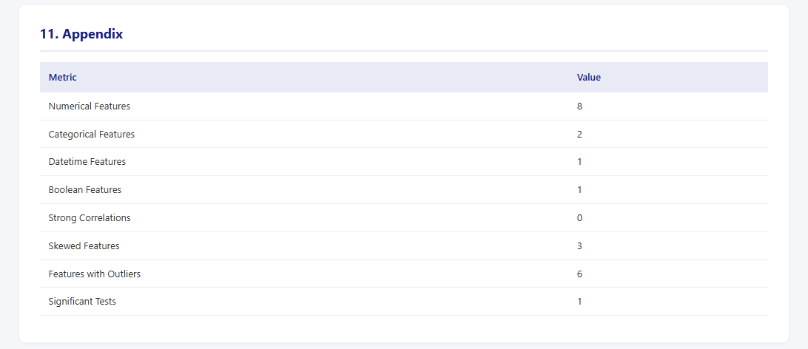

# AutoEDA

<p align="center">
  
  
  
  
  
  
</p>

<p align="center">
  <strong>Automated Exploratory Data Analysis for Professional BI Reporting</strong>
</p>

<p align="center">
  <a href="#installation">Installation</a> |
  <a href="#quick-start">Quick Start</a> |
  <a href="#screenshots">Screenshots</a> |
  <a href="#features">Features</a> |
  <a href="#api-reference">API Reference</a> |
  <a href="#examples">Examples</a> |
  <a href="#version-11-roadmap">Roadmap</a>
</p>

---

## Why This Project?

Every data analysis project starts the same way: check for missing values, compute correlations, plot distributions, identify outliers, and write up findings. Most analysts repeat this boilerplate for every dataset.

**AutoEDA** automates the entire exploratory analysis workflow and produces **consulting-firm-quality reports** (Deloitte/PwC style) with a single function call. It focuses purely on EDA — no preprocessing, no machine learning — just fast, deterministic, traceable insights.

Built alongside [DataPrepToolkit](https://github.com/Arasoul/DataPrepToolkit) (preprocessing) to form a complete data analysis toolkit.

## Ecosystem

AutoEDA is the second component of a modular data analysis ecosystem:

| Component | Purpose | Status |
|-----------|---------|--------|
| [DataPrepToolkit](https://github.com/Arasoul/DataPrepToolkit) | Data cleaning, imputation, validation, optimization | v1.0.0 |
| **AutoEDA** | Exploratory data analysis, statistics, visualization, reporting | v1.0.0 |
| AutoAnalytics | Advanced analytics (planned) | Coming soon |
| AutoBI | Business intelligence (planned) | Coming soon |

**How they relate:** DataPrepToolkit prepares data (clean, validate, optimize). AutoEDA analyzes data (profile, correlate, visualize, report). Use DataPrepToolkit when your data needs cleaning. Use AutoEDA when your data is ready for analysis. Each library works independently — there is no runtime dependency between them.

## Overview

AutoEDA is a production-quality Python package that performs end-to-end exploratory data analysis and generates executive-ready reports in HTML, PDF, and Markdown.

With one line of code, you get:

- **Dataset profiling** with variable classification and health scoring
- **Statistical analysis** including correlation, normality, hypothesis tests, and confidence intervals
- **12 visualization types** — histograms, KDE, boxplots, scatterplots, heatmaps, and more
- **Business insights** with severity ratings, traceable source metrics, and actionable recommendations
- **Professional HTML reports** with 11 sections, KPI cards, color-coded tables, and inline charts

## Installation

```bash
pip install autoeda
```

For PDF report generation:

```bash
pip install autoeda[pdf]
```

> **Note:** WeasyPrint requires system-level dependencies. On Ubuntu/Debian: `sudo apt install libpango-1.0-0 libpangocairo-1.0-0`. On macOS: `brew install pango`. On Windows, WeasyPrint bundles its dependencies. See [WeasyPrint docs](https://doc.courtbouillon.org/weasyprint/stable/first_steps.html#installation) for details.

For development:

```bash
git clone https://github.com/Arasoul/AutoEDA.git
cd AutoEDA
pip install -e ".[dev]"
```

## Quick Start

```python
import pandas as pd
from autoeda import AutoEDA

# Load your data
df = pd.read_csv("your_data.csv")

# Run the full EDA pipeline
results = AutoEDA().run(df)

# Access everything
results["profile"]         # DatasetProfile — shape, types, health score
results["statistics"]      # StatisticalAnalysis — correlations, tests, CIs
results["figures"]         # VisualizationResult — 12+ figure types
results["insights"]        # InsightResult — insights, recommendations, narrative
results["report_paths"]    # ReportResult — paths to HTML/MD/PDF reports
```

The HTML report is saved to `reports/autoeda_report.html` — a self-contained file with inline CSS and base64-encoded charts.

## Screenshots

AutoEDA generates consulting-firm-quality reports. Here are the key sections:

<p align="center">
  <br>
  <em>KPI Cards, Data Health Score &amp; Executive Summary</em>
</p>

<p align="center">
  <br>
  <em>Dataset Overview &amp; Health Score Detail</em>
</p>

<p align="center">
  <br>
  <em>Variable Summary with Semantic Type Classification</em>
</p>

<p align="center">
  <br>
  <em>Numerical &amp; Categorical Feature Statistics</em>
</p>

<p align="center">
  <br>
  <em>Normality Tests (Shapiro-Wilk, D'Agostino, KS)</em>
</p>

<p align="center">
  <br>
  <em>Distribution Analysis &amp; Outlier Analysis</em>
</p>

<p align="center">
  <br>
  <em>Distribution of Numerical Features (Histograms)</em>
</p>

<p align="center">
  <br>
  <em>Outlier Visualization</em>
</p>

<p align="center">
  <br>
  <em>Appendix</em>
</p>

## Features

### 1. Dataset Profiling

```python
from autoeda import DataProfiler

profile = DataProfiler().profile(df)

profile.n_rows                    # 1000
profile.n_columns                 # 12
profile.health_score.overall      # 87
profile.health_score.label        # "Good"
profile.missing_pct               # 3.2
profile.duplicate_rows            # 5

# Variable classification
for v in profile.variables:
    print(f"{v.column}: {v.semantic_type} (role={v.suggested_role})")
# age: numeric (role=feature)
# salary: identifier (role=index)
# department: categorical (role=feature)
# created_at: datetime (role=temporal)
```

**Semantic types detected:** `numeric`, `binary`, `categorical`, `ordinal`, `datetime`, `boolean`, `identifier`, `text`, `constant`

**Health score components:**
- **Completeness** (30%) — missing cell ratio
- **Uniqueness** (20%) — duplicate row ratio
- **Consistency** (20%) — constant/identifier/text column ratio
- **Analysis Readiness** (30%) — numeric features, row count, cardinality

### 2. Statistical Analysis

```python
from autoeda import Analytics

stats = Analytics().analyse(df, profile)

# Correlation
stats.pearson.n_significant      # 3
for pair in stats.pearson.significant_pairs:
    print(f"{pair.col_a} <-> {pair.col_b}: r={pair.coefficient:.2f}")
    print(f"  {pair.interpretation}")
    print(f"  Strength: {pair.strength_label}")

# Normality
for t in stats.normality.tests:
    print(f"{t.column}: normal={t.is_normal} (Shapiro p={t.shapiro_p:.4f})")

# Hypothesis tests
for t in stats.hypothesis_tests:
    print(f"{t.test_name}: {t.interpretation}")

# Confidence intervals
for ci in stats.confidence_intervals:
    print(f"{ci.column}: {ci.mean:.2f} [{ci.lower:.2f}, {ci.upper:.2f}]")
```

**Supported tests:**
- Pearson, Spearman, Kendall correlations
- Shapiro-Wilk, D'Agostino, Kolmogorov-Smirnov normality tests
- Independent t-test (2 groups), One-way ANOVA (3+ groups)
- Chi-square test of independence (categorical vs categorical)
- Confidence intervals for the mean

### 3. Visualizations (12 Types)

```python
from autoeda import Visualization

viz = Visualization()
result = viz.generate_all(df, profile, stats)

print(f"Generated {result.count} figures")

# Categories: distribution, comparison, relationship, matrix, quality, timeseries
for fig in result.all_figures:
    print(f"  [{fig.category}] {fig.title}")
```

**Figure types:**
| Category | Figures |
|----------|---------|
| Distribution | Histograms, KDE Plots |
| Comparison | Boxplots, Violin Plots, Count Plots |
| Relationship | Scatter Plots, Pair Plot, Bubble Charts |
| Matrix | Correlation Heatmap |
| Quality | Missing Values Heatmap, Outlier Visualisation |
| Time Series | Line Charts (datetime-indexed) |

### 4. Business Insights

```python
from autoeda import InsightEngine

engine = InsightEngine()
result = engine.generate(df, profile, stats)

# Insights with traceable source metrics
for ins in result.insights:
    print(f"[{ins.severity}] {ins.title}")
    print(f"  Source: {ins.source_metric}")

# Actionable recommendations
for rec in result.recommendations:
    print(f"[{rec.priority}] {rec.title}: {rec.detail}")

# Visualization suggestions
for vr in result.viz_recommendations:
    print(f"  Suggested: {vr.plot_type} ({vr.columns})")

# Executive summary with narrative
print(result.executive_summary.narrative)
# "The dataset contains 1000 rows and 12 columns (8 numerical, 4 categorical).
#  Data quality is good (health score: 87/100), suitable for analysis.
#  3 strong correlation(s) were identified..."
```

### 5. Professional Reports

```python
from autoeda import ReportGenerator

gen = ReportGenerator()
paths = gen.generate(profile, stats, figures, insights)

paths.html      # Path to HTML report
paths.markdown   # Path to Markdown report
paths.pdf        # Path to PDF report (requires weasyprint)
```

**HTML report sections (11):**
1. Executive Summary with narrative
2. Dataset Overview
3. Data Health Score (with visual progress bar)
4. Variable Summary (semantic types)
5. Statistical Analysis (numerical, categorical, normality, hypothesis tests)
6. Correlation Analysis (with interpretations)
7. Distribution Analysis (skewness recommendations)
8. Outlier Analysis (IQR breakdown)
9. Visualisations (inline base64 charts)
10. Key Insights & Recommendations (with viz suggestions)
11. Appendix

### 6. Configuration

```python
from autoeda import AutoEDA, AutoEDAConfig

config = AutoEDAConfig(
    enable_plots=True,
    figure_width=16.0,
    figure_height=8.0,
    figure_dpi=300,
    color_palette="Set2",
    correlation_threshold=0.7,
    confidence_level=0.95,
    significance_level=0.05,
    output_dir="my_reports",
    save_figures=True,
    save_reports=True,
    report_formats=["html", "markdown"],  # add "pdf" for PDF (requires weasyprint)
    max_categories=20,
    top_n_categories=10,
)

results = AutoEDA(config).run(df)
```

## Architecture

```
AutoEDA/
├── src/autoeda/
│   ├── __init__.py          # Public API + AutoEDA pipeline
│   ├── config.py            # AutoEDAConfig
│   ├── exceptions.py        # Custom exception hierarchy
│   ├── utils.py             # Stateless helpers
│   ├── profiler.py          # DataProfiler, classify_variables, HealthScore
│   ├── analytics.py         # Analytics, correlations, normality, hypothesis tests
│   ├── visualization.py     # Visualization, 12 figure types
│   ├── insight_engine.py    # InsightEngine, insights, recommendations
│   └── report_generator.py  # ReportGenerator, HTML/PDF/Markdown
├── tests/                   # 187 unit tests
├── examples/
│   └── full_workflow.py     # Complete workflow demo
├── pyproject.toml
├── README.md
├── RELEASE_NOTES.md
├── LICENSE
├── CHANGELOG.md
└── CONTRIBUTING.md
```

## API Reference

### AutoEDA (Pipeline)
- `AutoEDA(config)` — Create pipeline with optional config
- `AutoEDA.run(df)` — Execute full EDA pipeline, returns dict of results

### DataProfiler
- `DataProfiler(config).profile(df)` — Generate `DatasetProfile`
- `classify_variables(df)` — Classify every column into semantic types
- `compute_health_score(df, variables)` — Compute analysis-readiness score

### Analytics
- `Analytics(config).analyse(df, profile)` — Run all statistical analyses
- Returns `StatisticalAnalysis` with Pearson/Spearman/Kendall correlations, normality tests, hypothesis tests, confidence intervals

### Visualization
- `Visualization(config).generate_all(df, profile, stats)` — Generate all figures
- Returns `VisualizationResult` with `distribution`, `comparison`, `relationship`, `matrix`, `quality`, `timeseries` categories

### InsightEngine
- `InsightEngine(config).generate(df, profile, stats, figures)` — Generate insights
- Returns `InsightResult` with `insights`, `recommendations`, `viz_recommendations`, `executive_summary`

### ReportGenerator
- `ReportGenerator(config).generate(profile, stats, figures, insights)` — Generate reports
- Returns `ReportResult` with `html`, `markdown`, `pdf` paths

## Testing

```bash
# Run all tests
python -m pytest tests/ -v

# Run with coverage
python -m pytest tests/ --cov=autoeda --cov-report=term-missing

# Lint and type check
ruff check src/ tests/
mypy src/
```

## Requirements

- Python 3.11+
- pandas >= 2.0.0
- numpy >= 1.24.0
- scipy >= 1.11.0
- matplotlib >= 3.7.0
- seaborn >= 0.13.0
- jinja2 >= 3.1.0
- weasyprint >= 60.0 (optional, for PDF reports — install with `pip install autoeda[pdf]`)

## Tested Dataset Sizes

AutoEDA works with any DataFrame size. The following ranges have been validated:

| Dataset Size | Expected Behavior |
|-------------|-------------------|
| < 100 rows | All analyses run. Statistical tests may lack power (health score will flag this). |
| 100 - 10,000 rows | Optimal range. All features work as expected. |
| 10,000 - 100,000 rows | Correlation and hypothesis tests may take a few seconds. Figures render normally. |
| 100,000+ rows | Works but correlation/hypothesis tests scale quadratically with column count. Consider sampling for very wide datasets (100+ columns). |

All analyses are deterministic — running AutoEDA twice on the same DataFrame produces identical results.

## Examples

A complete working example is provided in [`examples/full_workflow.py`](examples/full_workflow.py):

```bash
python examples/full_workflow.py
```

This generates a sample dataset, runs the full pipeline, and prints results to the console. Reports are saved to `reports/autoeda_demo/`.

## Version 1.1 Roadmap

Future enhancements planned for the next minor release. No release dates are committed.

### High Priority

- Optional integration with DataPrepToolkit outputs
- `PipelineResult` typed return object (replacing raw `dict`)
- Improved large dataset support (chunked processing)

### Medium Priority

- Jupyter notebook examples for interactive use
- API documentation generation (Sphinx / mkdocstrings)
- Dependency caching in CI
- Security scanning in CI (pip-audit / safety)
- Additional real-world integration tests
- Configurable visualization generation (select specific figure types)

### Low Priority

- HTML template extraction for customization
- Visualization helper refactoring
- CLI interface (only if future demand justifies it)

## Changelog

See [CHANGELOG.md](CHANGELOG.md) for release history.

## Contributing

See [CONTRIBUTING.md](CONTRIBUTING.md) for guidelines.

## License

MIT License - see [LICENSE](LICENSE) for details.

## Author

**Ahmed** - [GitHub](https://github.com/Arasoul)
